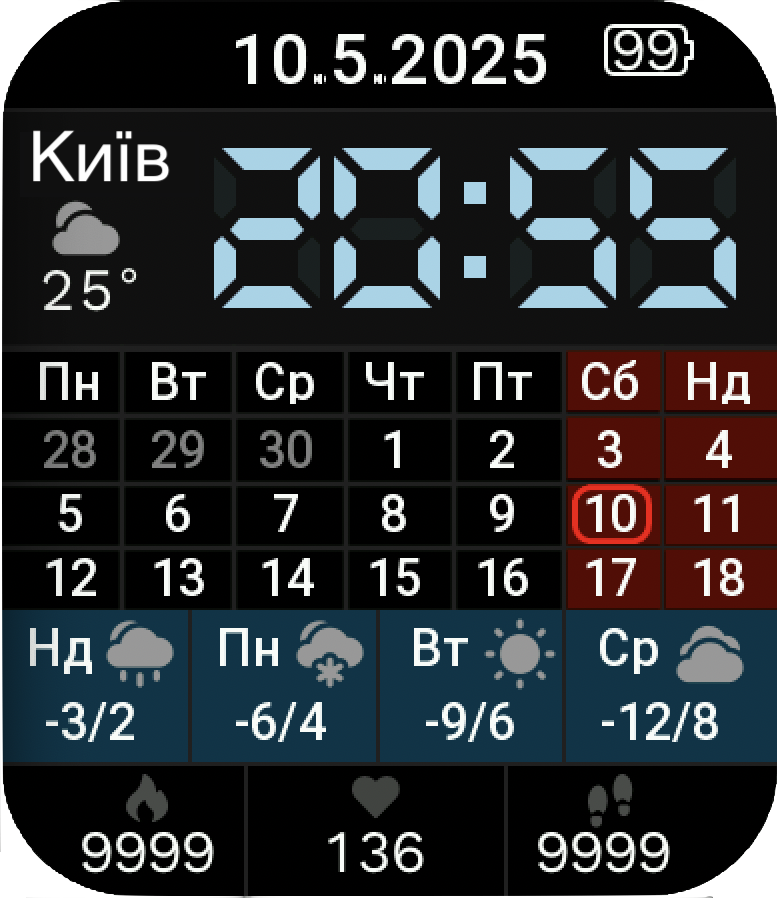

### Watchface for amazfit

Quick-start: https://docs.zepp.com/docs/guides/quick-start/

To run simulator:
`cd /Applications/simulator.app/Contents/MacOS && sudo -s ./simulator`

Run dev mode:
`zeus dev`

Generate QR to install in Dev mode:
`zeus preview`

##### Amazfit-active

View logs:
https://docs.zepp.com/docs/guides/tools/zepp-app/#view-real-machine-logs

API:
https://docs.zepp.com/docs/watchface/watchface-quick-start/

